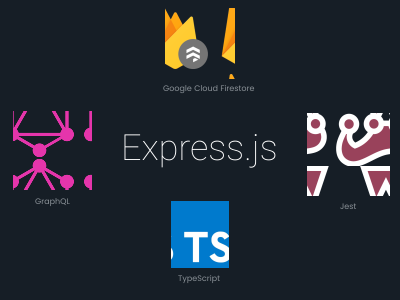
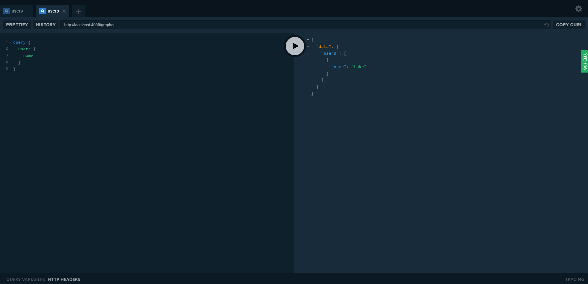

<p align="center" style="width: 100%">
	
</p>

<h3 align="center">
	Timesheets Back-end API service template with Express.js, GraphQL, TypeScript, Jest and Google Cloud Firestore.
</h3>

<p align="center">
	
</p>

## Overview

- **GraphQL** _GraphQL is a query language for APIs and a runtime for fulfilling those queries with your existing data._
- **Jest** The go-to Javascript testing solution for Facebook.
- **Express.js** Allows the server to run multiple routes for the API. Most of it's handled by GraphQL Apollo Server.
- **TypeScript** Javascript the way it should be. Strongly typed.
- **Google Cloud Firestore** The database to drive the API however, it also implements [TypeORM](https://github.com/typeorm/typeorm) and all that's required is to edit the `ormconfig.json.sample` file and the `resolvers` in which it reads/manipulates data.
- **[GraphDoc](https://github.com/2fd/graphdoc)** Static page generator for GraphQL.
- **[TypeORM](https://github.com/typeorm/typeorm)** Object-relational mapping for Firestore (_implemention is in development_) & other database drivers.

## Installation and usage

### Using git

The following commands will install and run the development version:

```sh
git clone https://github.com/lukepaoloni/typegraphql-boilerplate.git
cd typegraphql-boilerplate
npm install
npm buildAndStart
```

Navigate to `http://localhost:4000/graphql` in the browser. You're good to go!

⚠️ While it is the most recent codebase, this is not production-ready! Run at
your own risk. It is also not recommended to run this as root.
